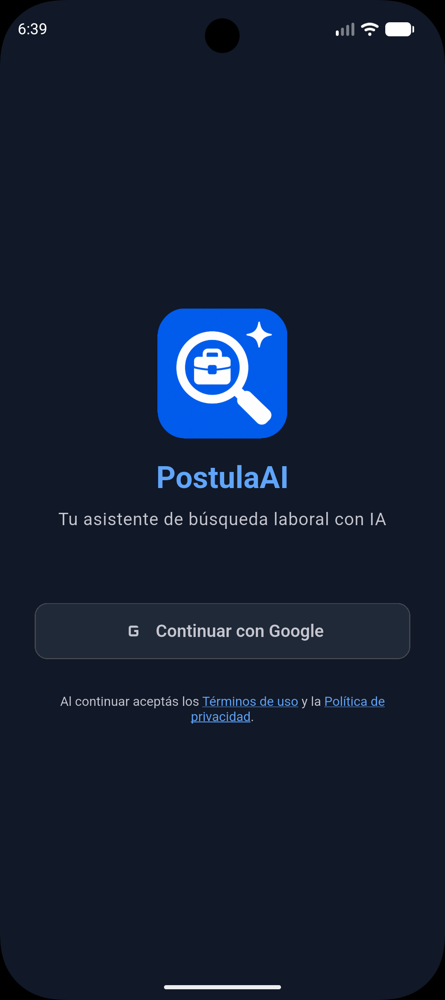
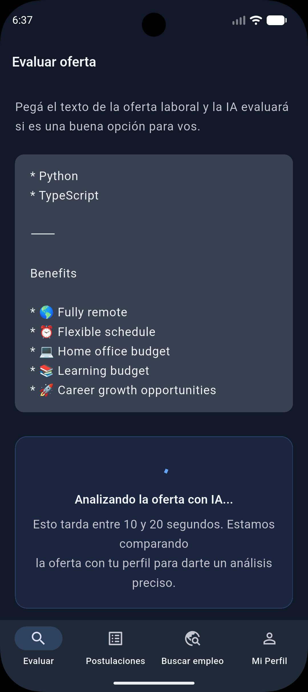
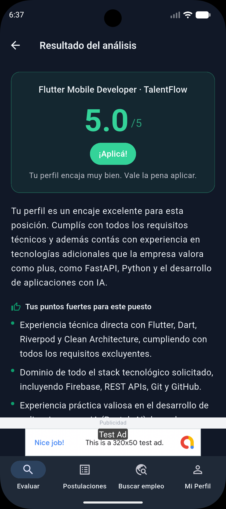
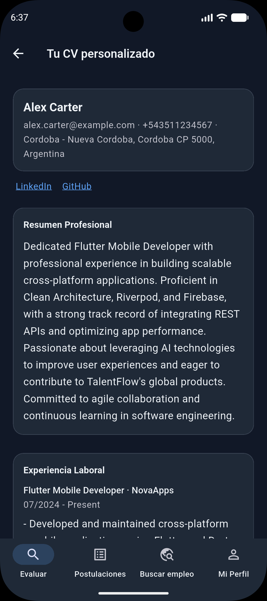
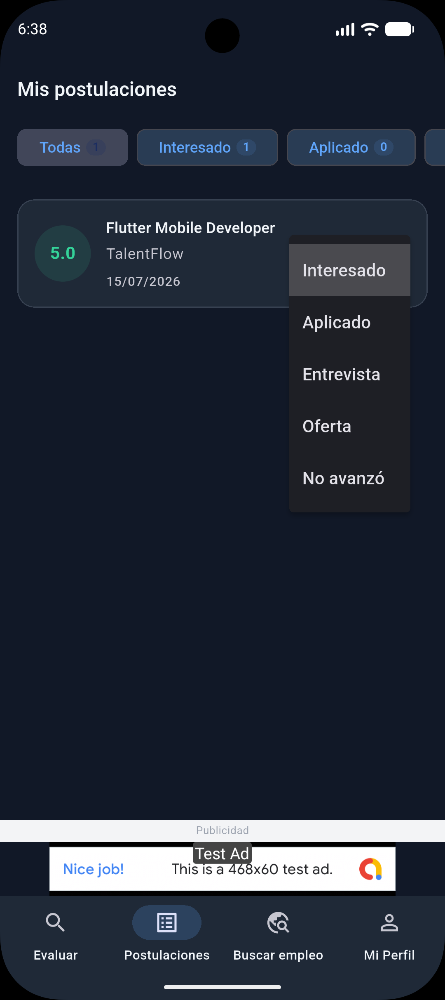
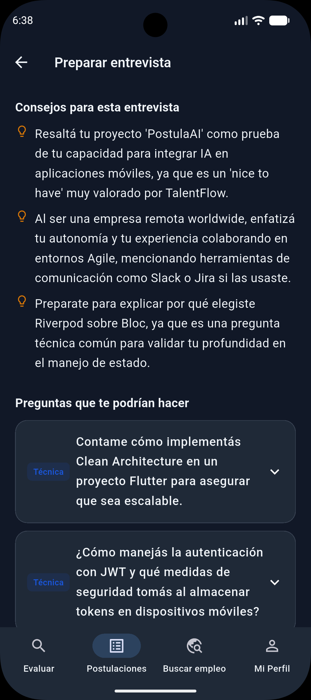

# PostulaAI

**AI-powered job search assistant for the Argentine job market.**

A mobile-first Flutter app that helps people evaluate job offers, generate tailored CVs, track applications, and prepare for interviews — without needing any technical background.

---

## The problem

AI tools for job searching exist, but most require a terminal, a CLI, or editing config files. That excludes the people who could benefit the most: professionals reinventing their careers, workers with little digital experience, and people without strong professional networks.

In Argentina, that's a large share of the job-seeking population.

## The solution

A Flutter app (Android + iOS) that brings AI-assisted job search — offer evaluation, personalized CVs, interview prep — into a simple mobile interface anyone can use from their phone.

---

## Screenshots

| Login | Evaluate offer | Result | Personalized CV | Applications | Coach |
|:---:|:---:|:---:|:---:|:---:|:---:|
|  |  |  |  |  |  |

---

## What's built and working

### 1. Guided Profile (Onboarding)
Step-by-step onboarding that builds a complete professional profile: personal info, work experience (with references), education, certifications, skills, languages, projects, salary expectations, work modality preferences, and excluded industries/companies. Stored in Firestore and reused across every other feature.

### 2. Job Offer Evaluator
User pastes a job posting. The AI compares it against the user's profile and returns a fit score, strengths, gaps, and a recommendation — with strict guardrails so it never fabricates experience the user doesn't have.

### 3. Personalized CV Generator
For any evaluated offer, generates a tailored PDF: detects the offer's language (Spanish/English) and writes the CV in that language, includes only relevant projects/certifications/skills for that specific role, and pulls in contact links and references when available. Cached so it's not regenerated unnecessarily.

### 4. Application Tracker
Visual pipeline of every application by status (Interested → Applied → Interview → Offer). Swipe-to-delete with undo, full cascade cleanup of related data on deletion.

### 5. Interview Coach
Generates likely interview questions (technical, behavioral, motivational) plus coaching tips and things to avoid, based on the candidate's real profile and the job's actual requirements. Cached per application.

### 6. Subscription / Freemium
Daily usage limits for evaluations, CV generation, and coach sessions on the free tier. Premium tier removes limits and ads, managed through RevenueCat. Usage counters are enforced server-side to prevent client-side tampering.

### 7. Job Search Portals
Quick-access list of major Argentine job boards (Bumeran, ZonaJobs, LinkedIn Jobs, Computrabajo, GetOnBoard). Users pick which of their skills to search for and the app opens a pre-built search query in the selected portal.

### 8. Ads
AdMob banner (tracker screen), interstitial (every 2 evaluations), and rewarded ads (before PDF download or share) — shown only to free-tier users.

### 9. Legal Screens
Privacy policy and Terms of service screens, accessible from the login screen (before creating an account) and from the user profile. No authentication required.

---

## Tech Stack

```
Flutter (Android + iOS)
  ↓
Firebase Cloud Functions (TypeScript)  ←→  Google Gemini 3.1 Flash Lite
  ↓
Firestore (profiles, evaluations, applications, CVs, coach sessions, subscriptions, usage)
Firebase Auth (Google Sign-In)
```

- **State management:** Riverpod with code generation (`@riverpod`)
- **Architecture:** Clean Architecture, feature-first (`data/ domain/ presentation/` per feature)
- **Navigation:** go_router
- **Error handling:** `Either<Failure, T>` in domain, `AsyncValue` in presentation
- **Monetization:** AdMob (ads) + RevenueCat (subscriptions)
- **PDF generation:** client-side with the `pdf` package

**Why Cloud Functions for every AI call?**
The Gemini API key never reaches the client. Usage limits are enforced server-side. The user's profile is merged with the prompt on the backend, not exposed to the app.

**Why Gemini 3.1 Flash Lite?**
Generous free tier, large context window (enough for a full profile + job offer + instructions), and thinking disabled (`thinkingConfig: { thinkingBudget: 0 }`) for faster, cheaper responses on structured-output tasks like these.

---

## AI Architecture

AI behavior is defined in standalone prompt files under `modes/`, not hardcoded in TypeScript:

```
modes/
  evaluate_es.md   → job-fit evaluation logic
  cv_es.md         → personalized CV generation rules
  coach_es.md      → interview preparation logic
```

Cloud Functions read these files, inject the user's profile and the job offer text, and call Gemini. Keeping prompts separate from code makes them easy to iterate on without touching application logic, and they're version-controlled like any other source file.

User-supplied job offer text is sanitized before being interpolated into prompts (`functions/src/utils/sanitize.ts`) to reduce prompt-injection risk.

---

## Project Structure

```
postula_ai/
├── CLAUDE.md                  # Project context for AI coding agents
├── README.md
├── pubspec.yaml
├── modes/                     # Gemini prompts (Spanish)
│   ├── evaluate_es.md
│   ├── cv_es.md
│   └── coach_es.md
├── lib/
│   ├── core/                  # Router, theme, constants, error types
│   ├── features/
│   │   ├── profile/           # Onboarding + profile CRUD
│   │   ├── evaluation/        # Job offer evaluator
│   │   ├── tracker/           # Application pipeline
│   │   ├── cv_generator/      # CV generation + PDF export
│   │   ├── coach/             # Interview prep
│   │   ├── subscription/      # Freemium logic + RevenueCat
│   │   ├── job_search/        # Job portal quick-access
│   │   ├── ads/               # AdMob integration
│   │   └── legal/             # Privacy policy and Terms of service
│   └── shared/                # Cross-feature providers and widgets
├── functions/                 # Firebase Cloud Functions (TypeScript)
│   └── src/
│       ├── index.ts
│       ├── evaluate.ts
│       ├── generate_cv.ts
│       ├── coach.ts
│       └── utils/
└── test/
```

---

## Setup

> This repo does not include `.env`, `google-services.json`, `GoogleService-Info.plist`, or any other Firebase config. These are specific to your own Firebase project and must never be committed to version control. To run this project, create your own Firebase project and obtain your own credentials.

### Required Environment Variables

`functions/.env` (never committed):
```
GEMINI_API_KEY=your_google_ai_studio_key_here
```
Get a key at [Google AI Studio](https://aistudio.google.com/app/apikey).

### Firebase Config Files (never committed)
- `android/app/google-services.json` — Firebase Console → Project Settings → Android
- `ios/Runner/GoogleService-Info.plist` — Firebase Console → Project Settings → iOS
- `lib/firebase_options.dart` — generated by FlutterFire CLI (see step 3 below)

`lib/firebase_options.dart.example` is committed and shows the expected shape.

### Local Development

```bash
# 1. Create a Firebase project at https://console.firebase.google.com
#    Enable: Authentication, Firestore, Cloud Functions, Storage

# 2. Flutter setup
flutter pub get

# 3. Generate lib/firebase_options.dart with FlutterFire CLI
npm install -g firebase-tools
firebase login
firebase use --add
dart pub global activate flutterfire_cli
flutterfire configure    # generates lib/firebase_options.dart automatically

# 4. Generate code (freezed, riverpod)
dart run build_runner build --delete-conflicting-outputs

# 5. Cloud Functions
cd functions
npm install
cp .env.example .env   # add your GEMINI_API_KEY

# 6. Deploy rules and functions
firebase deploy --only firestore:rules
firebase deploy --only functions

# 7. Local emulators (free local testing)
firebase emulators:start

# 8. Run the app
flutter run
```

---

## AI-Augmented Development

This project was built solo, end-to-end, using Claude Code as a core part of the development workflow — not just for autocomplete, but for architecture decisions, debugging, and feature implementation. The repo includes:

- `CLAUDE.md` — persistent project context loaded automatically every session
- `.claude/skills/` — task-specific knowledge for Flutter and Cloud Functions work, loaded on demand
- `.claude/agents/` — custom subagents (a read-only code reviewer, a codebase explorer) for isolated, focused tasks

This setup reflects a deliberate approach to AI-assisted engineering: structured context, reusable expertise, and tool boundaries — rather than ad-hoc prompting.

---

## Why this is also a portfolio project

- Demonstrates Clean Architecture across a real multi-feature app, not a tutorial project
- Full Firebase integration: Auth, Firestore, Cloud Functions, Storage, security rules
- Real AI-native development: server-side prompt engineering, structured outputs, anti-hallucination guardrails, and cost/usage controls — not just calling an API once
- Solves a real, well-defined user problem end-to-end
- Built with production concerns in mind: error handling, accessibility, monetization, freemium enforcement
